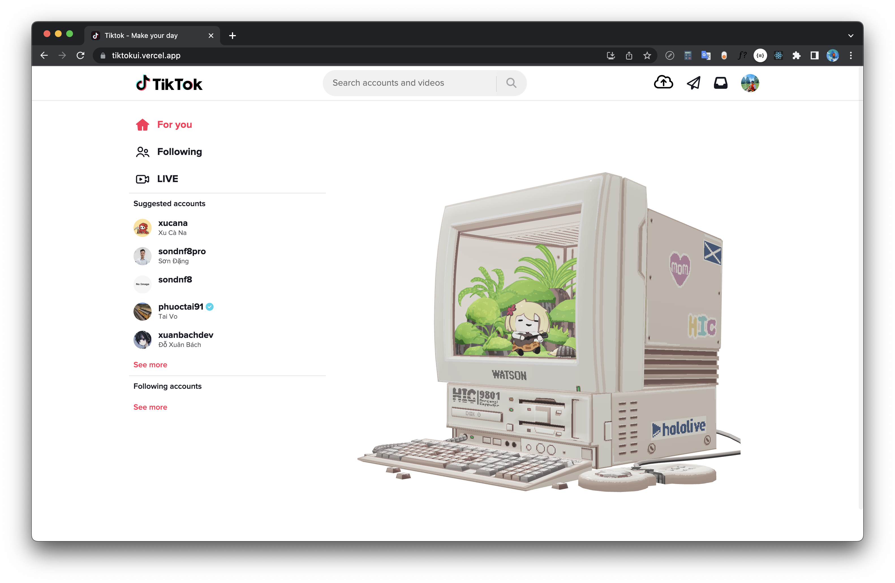

## A small reactjs web-based platform that replicates Tiktok Interfaces with some additional 3D models 🌱

### Link Demo 📌

[https://tiktokui.vercel.app/](https://tiktokui.vercel.app/)

### Technologies ✨

-   `ReactJs`
-   `Scss`
-   RESTful API with `axios`
-   `ThreeJs` + `react-three/fiber` + `react-three/drei`

### License :right_anger_bubble:

[MIT](https://choosealicense.com/licenses/mit/)
